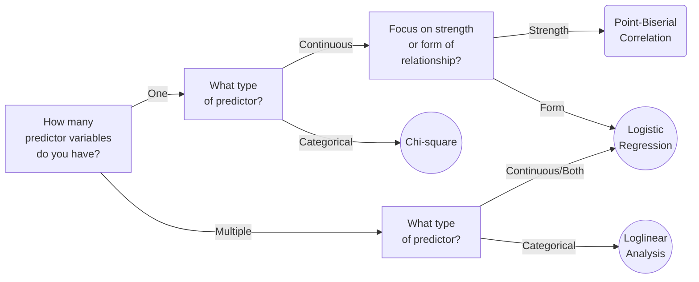
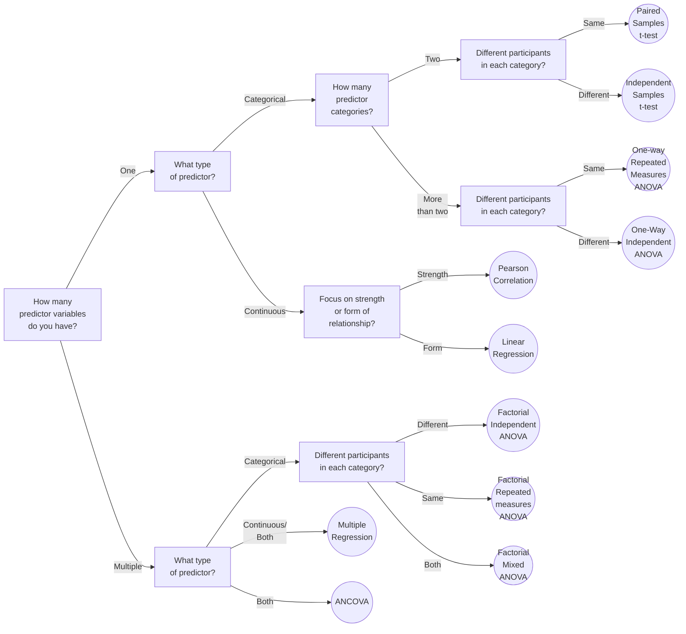
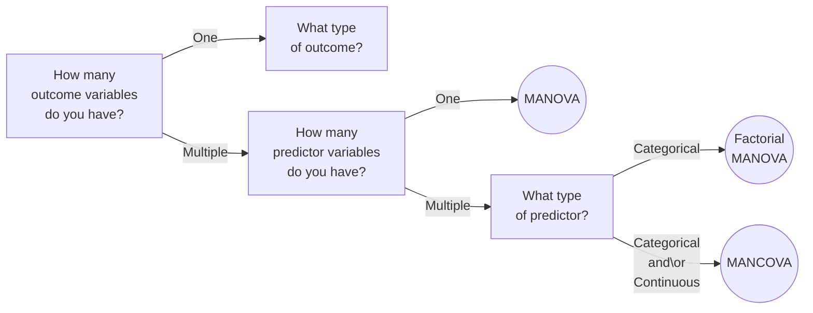

## Statistical Test Flowchart
### Single categorical outcome variables:

```mermaid
flowchart LR
    h[How many\npredictor variables\ndo you have?]
    h -- One --> j[What type\nof predictor?]
    h -- Multiple --> k[What type\nof predictor?]
    j -- Categorical --> n((Chi-square))
    j -- Continuous --> o[Focus on strength\nor form of\nrelationship?]
    o -- Strength --> p(Point-Biserial\nCorrelation)
    o -- Form --> r((Logistic\nRegression))
    k -- Continuous/Both --> r
    k -- Categorical --> q((Loglinear\nAnalysis))
```
### Single continuous outcome variables:

```mermaid
flowchart LR
    i[How many\npredictor variables\ndo you have?]
    i -- One --> l[What type\nof predictor?]
    i -- Multiple --> m[What type\nof predictor?]
    l -- Categorical --> t[How many\npredictor\ncategories?]
    l -- Continuous --> lg[Focus on strength\nor form of\nrelationship?]
    lg -- Strength --> u1((Pearson\nCorrelation))
    lg -- Form --> u2((Linear\nRegression))
    m -- Categorical --> v[Different participants\nin each category?]
    m -- Continuous/\nBoth --> w((Multiple\nRegression))
    m -- Both --> x((ANCOVA))
    v -- Different --> y((Factorial\nIndependent\nANOVA))
    v -- Same --> z((Factorial\nRepeated\nmeasures\nANOVA))
    v -- Both --> aa((Factorial\nMixed\nANOVA))
    t -- Two --> ab[Different participants\nin each category?]
    t -- More\nthan two --> ac[Different participants\nin each category?]
    ab -- Same --> ad((Paired\nSamples\nt-test))
    ab -- Different --> ae((Independent\nSamples\nt-test))
    ac -- Same --> aj((One-way\nRepeated\nMeasures\nANOVA))
    ac -- Different --> ak((One-Way\nIndependent\nANOVA))
```
### Multiple outcome variables:

```mermaid
flowchart LR
    a[How many\noutcome variables\ndo you have?]
    a -- One --> b[What type\nof outcome?]
    a -- Multiple --> c[How many\npredictor variables\ndo you have?]
    c -- One --> d((MANOVA))
    c -- Multiple --> e[What type\nof predictor?]
    e -- Categorical --> f((Factorial\nMANOVA))
    e -- Categorical\nand\or\nContinuous --> g((MANCOVA))
```
